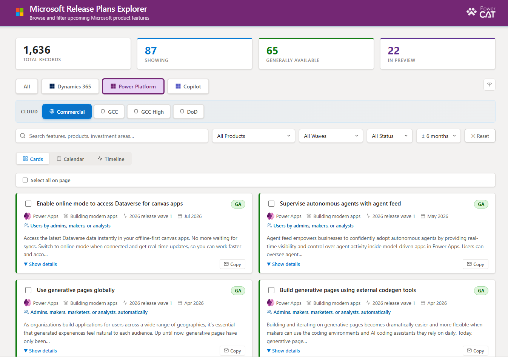
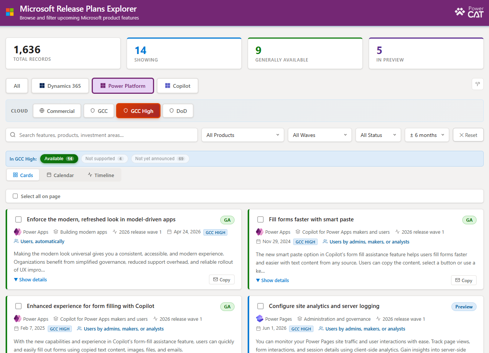
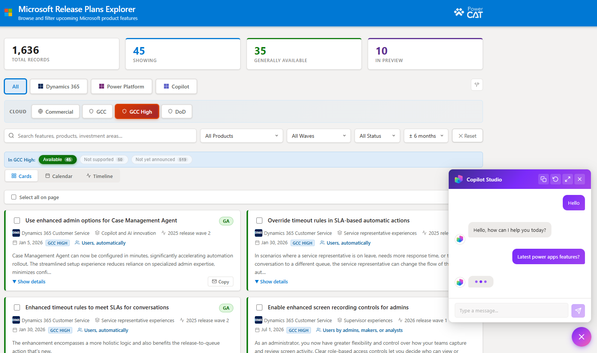

# CodeApps

A collection of **Power Apps Code Apps** for browsing Microsoft Dynamics 365 and Power Platform release plans.



This repository contains two variants of the same app:

| App | Copilot Agent | Best for |
|-----|:-------------:|----------|
| **Release Planner** | Yes | Full experience with an in-app Copilot Studio chat agent for asking questions about release plans |
| **Release Planner Lite** | No | Lightweight version for environments without Copilot Studio, or where the chat agent is not needed |

Both apps share the same core: search, filter, and explore release plan items for Dynamics 365 and Power Platform — including **sovereign cloud availability** (GCC, GCC High, DoD).

---

## Features

- **Search & filter** release plan items by product, investment area, status, and release wave
- **Sovereign cloud view** — see availability dates for **GCC, GCC High, and DoD**, with clear indicators for features that are *not supported* or *not yet announced* for each cloud
- **At-a-glance stats** — total records, items in preview, and generally available counts
- **Copilot Studio agent** *(Full version only)* — ask natural-language questions about release plans
- Data sourced live from Microsoft Release Plans feed via a custom connector

---
## Screenshots

### Main view


### Sovereign cloud filter


### Copilot chat (Full version)


## Prerequisites

Before deploying either app you will need:

- A **Power Platform environment** where you have maker/system customizer rights
- **Code apps enabled** on that environment (see Step 1 — required, code apps will not run otherwise)
- A **Power Apps Premium license** for any end-user who will run the app
- The **Release Plans custom connector** (included in the solution packages)
- For the **Full version**: a **Copilot Studio** agent

> The solution packages are **unmanaged** — intended for environments where you want to view and customize components.

---

## Option A — Deploy from the solution package (fastest)

### Step 1 — Enable code apps on your environment

Code apps must be turned on at the environment level first (admin action):

1. Go to the [Power Platform admin center](https://admin.powerplatform.microsoft.com).
2. **Manage** > **Environments** > select your target environment.
3. **Settings** > expand **Product** > select **Features**.
4. Find **Power Apps code apps** and turn on the **Enable code apps** toggle.
5. Select **Save**.

Full details: [Enable code apps on a Power Platform environment](https://learn.microsoft.com/en-us/power-apps/developer/code-apps/overview#enable-code-apps-on-a-power-platform-environment)

### Step 2 — Import the unmanaged solution

1. Download the solution zip (`ReleasePlanner_x_x_x_x.zip` for Full, `ReleasePlannerLite_x_x_x_x.zip` for Lite).
2. Go to [make.powerapps.com](https://make.powerapps.com) > **Solutions** > **Import solution**.
3. Select the zip and proceed through the prompts.

### Step 3 — Create a connection and bind the connection reference

The solution includes a connection reference for the custom connector that points to the Release Planner API:

1. Create a **connection** for the Release Plans custom connector (via the import prompt, or **make.powerapps.com > Connections > + New connection**).
2. Link the solution's **connection reference** to that connection.

### Step 4 — Run the app

Find the app under **Apps** and run it.
Share the App with users.

---

## Option B — Build and deploy from source (for developers)

> Make sure code apps are enabled on your environment first (Option A, Step 1).

```powershell
git clone <repourl>
cd CodeApps
cd "Release Planner"  or "Release Planner Lite"
npm install
npx power-apps init
npw power-apps add-data-source (for Custom Connector and/or Copilot Studio Agent)
npm run build
npx power-apps push
```

---

## Custom connector setup

The app reads release plan data through a custom connector that calls Microsoft's Release Plans feed:
https://releaseplans.microsoft.com/en-US/allreleaseplans/

This feed returns **all** release plan items as a single JSON payload (no server-side filtering), so the app filters client-side. The connector handles CORS and provides a typed data source.

---

## Copilot Studio setup (Full version only)

The Full version includes an in-app Copilot chat widget backed by a Copilot Studio agent. Ensure the agent is present in your environment (imports with the Full solution package), and verify the configuration after import. The **Lite version does not include or require** any Copilot Studio agent.

---

## Sovereign cloud availability

Availability per cloud comes from the `GeographicAreasDetails` field. Entries look like `"US GCC (Jan 5, 2026)"`, `"US GCC High (Jan 5, 2026)"`, `"US DoD (Jan 5, 2026)"`.

| State | Meaning |
|-------|---------|
| **Available** | An availability date is published for that cloud |
| **Not supported** | Microsoft explicitly marked the feature as not coming to that cloud |
| **Not yet announced** | No information published for that cloud yet |

Use the **Cloud** filter to switch between Commercial, GCC, GCC High, and DoD.

---
