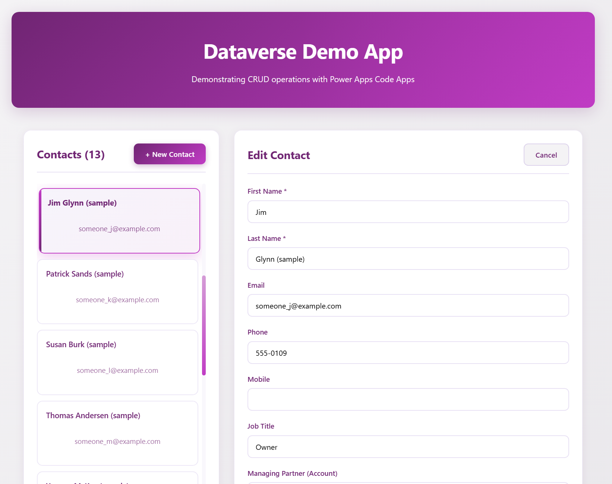

# Dataverse Demo App

A complete demonstration of Power Apps Code Apps with Dataverse integration. This app showcases CRUD operations, lookup field resolution, and modern React architecture patterns using PAC CLI generated services.




## What This Demo Shows

- **CRUD Operations** — Create, Read, Update, and Delete contacts in Dataverse
- **Lookup Fields** — Reading and writing relationships using `@odata.bind` syntax and efficient on-demand resolution
- **Three-Layer Architecture** — UI components, custom hooks, generated services with clear separation
- **Generated Services** — Using PAC CLI auto-generated TypeScript services exclusively (no direct API calls)
- **Error Handling** — Try-catch at every layer with user-friendly messages and loading states
- **Type Safety** — Full TypeScript with auto-generated Dataverse models

## Prerequisites

- **Node.js v22** or higher ([Download](https://nodejs.org/))
- **Power Platform CLI** (`pac`) ([Install Guide](https://learn.microsoft.com/en-us/power-platform/developer/cli/introduction))
- **Power Platform environment** with Dataverse and Power Apps Code Apps enabled

## Quick Start

### 1. Authenticate and connect

```bash
pac auth create
pac env select --environment <Your environment ID>
```

### 2. Install dependencies

```bash
npm install
```

### 3. Run locally

```bash
npm run dev
```

Open the **Local Play** URL in the same browser profile as your Power Platform tenant.

### 4. Deploy (optional)

```bash
npm run build
pac code push
```

## Project Structure

```
src/
├── components/               # UI components (presentation only, no business logic)
│   ├── Header.tsx
│   ├── ContactCard.tsx       # Single contact card with lookup display
│   ├── ContactList.tsx       # Grid of cards with New Contact button
│   ├── ContactForm.tsx       # Create/edit form with lookup dropdown
│   ├── ErrorMessage.tsx
│   └── Footer.tsx
│
├── hooks/                    # Business logic and state management
│   ├── useContacts.ts        # Contact CRUD operations and form state
│   ├── useAccounts.ts        # Account data for dropdowns
│   └── useLookupResolver.ts  # Resolves lookup GUIDs to display names
│
├── generated/                # Auto-generated by PAC CLI — do not edit manually
│   ├── models/               # TypeScript entity types
│   └── services/             # Dataverse CRUD services
│
├── App.tsx                   # Composition layer (thin — no business logic)
└── App.css                   # Application styles
```

## Key Features

### CRUD Operations

The app demonstrates all four operations on the Dataverse `contact` table:

| Operation | Service Method                     | Notes                                                  |
| --------- | ---------------------------------- | ------------------------------------------------------ |
| Create    | `ContactsService.create(data)`     | Validate → prepare payload with OData bind for lookups |
| Read      | `ContactsService.getAll(options)`  | `select`, `orderBy`, `top` for optimized queries       |
| Update    | `ContactsService.update(id, data)` | Send changed fields; OData bind for lookup changes     |
| Delete    | `ContactsService.delete(id)`       | Confirmation → delete → reload list                    |

### Lookup Fields

The app demonstrates both sides of Dataverse lookup relationships. See [LOOKUPS.md](./LOOKUPS.md) for the full deep dive.

**Writing a lookup (create/update):**

```typescript
// Link contact to account using OData bind syntax
contact['parentcustomerid_account@odata.bind'] = `/accounts(${accountId})`;

// Clear a lookup by setting it to null
updates['parentcustomerid_account@odata.bind'] = null;
```

**Reading a lookup (on-demand resolution):**

```typescript
// Step 1: Load contacts with lookup GUID fields
ContactsService.getAll({
  select: ['contactid', 'firstname', '_msa_managingpartnerid_value']
});

// Step 2: Resolve the GUID to a display name when needed
AccountsService.get(contact._msa_managingpartnerid_value, {
  select: ['accountid', 'name']
});
```

### Generated Services

All Dataverse access goes through PAC CLI generated services. Never use direct API calls.

```typescript
const result = await ContactsService.getAll({
  select: ['contactid', 'firstname', 'lastname'],
  filter: 'statecode eq 0',
  orderBy: ['createdon desc'],
  top: 50,
});
```

## Usage

1. **View contacts** — App loads and displays all contacts on start
2. **Create** — Click "New Contact", fill the form, click "Create Contact"
3. **Edit** — Click any contact card to open it in the edit form
4. **Delete** — Click "Delete" on a card and confirm the dialog
5. **Lookup** — Use the "Managing Partner" dropdown to link contacts to accounts

## Extending the Demo

To add a new Dataverse table:

```bash
pac code add-data-source -a dataverse -t <table-logical-name>
```

This generates service and model files in `src/generated/`. Then create components and hooks following the existing patterns in `src/hooks/` and `src/components/`.

## Troubleshooting

| Issue                 | Solution                                                                    |
| --------------------- | --------------------------------------------------------------------------- |
| Authentication failed | Run `pac auth create`                                                       |
| Table not found       | Ensure Contact and Account tables exist in your environment                 |
| Node version error    | Run `nvm use 22`                                                            |
| CORS errors           | Access via the Local Play URL from the CLI output, not `localhost` directly |
| Build errors          | Delete `node_modules` and run `npm install` again                           |

## Documentation

| File                                 | Description                                                                                                                    |
| ------------------------------------ | ------------------------------------------------------------------------------------------------------------------------------ |
| [README.md](./README.md)             | This file — overview, quick start, features, usage, and troubleshooting                                                        |
| [ARCHITECTURE.md](./ARCHITECTURE.md) | Three-layer architecture, component hierarchy, data flow diagrams, event flows, and design patterns                            |
| [LOOKUPS.md](./LOOKUPS.md)           | Deep dive on lookup fields — naming conventions, reading GUIDs, writing with `@odata.bind`, and efficient on-demand resolution |
| [DEVELOPMENT.md](./DEVELOPMENT.md)   | Step-by-step guide to recreate this demo from scratch using the PAC CLI                                                        |

## References

- [Power Apps Code Apps](https://learn.microsoft.com/en-us/power-apps/developer/code-apps/)
- [Create an app from scratch](https://learn.microsoft.com/en-us/power-apps/developer/code-apps/how-to/create-an-app-from-scratch)
- [Connect to Dataverse](https://learn.microsoft.com/en-us/power-apps/developer/code-apps/how-to/connect-to-dataverse)
- [Dataverse Web API](https://learn.microsoft.com/en-us/power-apps/developer/data-platform/webapi/overview)
- [Power Platform CLI Reference](https://learn.microsoft.com/en-us/power-platform/developer/cli/introduction)
