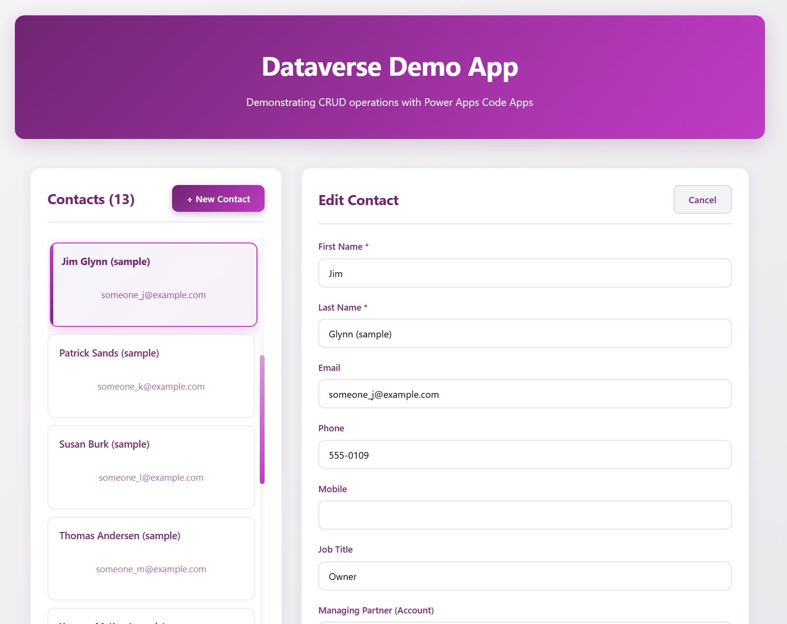

# Dataverse Demo App

A complete demonstration of Power Apps Code Apps with Dataverse integration. This app showcases CRUD operations, lookup field resolution, Dataverse functions and actions, and modern React architecture patterns using Power Apps CLI generated services.




## What This Demo Shows

- **CRUD Operations** — Create, Read, Update, and Delete contacts in Dataverse
- **Lookup Fields** — Reading and writing relationships using `@odata.bind` syntax and efficient on-demand resolution
- **File Attachments** — Uploading, downloading, and deleting files and images on Dataverse file/image columns
- **Dataverse Functions & Actions** — Three API patterns via generated services: unbound function (`WhoAmI`), unbound action (`SetAutoNumberSeed`), and bound action (`ConvertOwnerTeamToAccessTeam`)
- **Three-Layer Architecture** — UI components, custom hooks, generated services with clear separation
- **Generated Services** — Using Power Apps CLI auto-generated TypeScript services exclusively (no direct API calls)
- **Error Handling** — Try-catch at every layer with user-friendly messages and loading states
- **Type Safety** — Full TypeScript with auto-generated Dataverse models

## Prerequisites

- **Node.js v22** or higher ([Download](https://nodejs.org/))
- **Power Apps CLI** (`npx power-apps`) — included in `@microsoft/power-apps` ([npm](https://www.npmjs.com/package/@microsoft/power-apps))
- **Power Platform environment** with Dataverse and Power Apps Code Apps enabled

## Quick Start

### 1. Install dependencies

```bash
npm install
```

### 2. Initialize the app

```bash
npx power-apps init --environment-id <your-environment-id> --display-name "Dataverse Demo App"
```

### 3. Add data sources

```bash
npx power-apps add-data-source --api-id dataverse --resource-name contact --org-url <org-url>
npx power-apps add-data-source --api-id dataverse --resource-name account --org-url <org-url>
```

### 4. Run locally

```bash
npm run dev
```

Open the **Local Play** URL in the same browser profile as your Power Platform tenant.

### 5. Deploy (optional)

```bash
npm run build
npx power-apps push
```

## Project Structure

```
src/
├── components/               # UI components (presentation only, no business logic)
│   ├── Header.tsx
│   ├── ContactCard.tsx       # Single contact card with lookup display
│   ├── ContactList.tsx       # Grid of cards with New Contact button
│   ├── ContactForm.tsx       # Create/edit form with lookup dropdown
│   ├── AccountList.tsx       # Account list for file attachments tab
│   ├── AccountForm.tsx       # Account form + file/image attachment sub-form
│   ├── ApiActionsPanel.tsx   # Functions & Actions tab with three API patterns
│   └── ErrorMessage.tsx
│
├── hooks/                    # Business logic and state management
│   ├── useContacts.ts        # Contact CRUD operations and form state
│   ├── useAccounts.ts        # Account data for dropdowns
│   ├── useAccountsCrud.ts    # Full Account CRUD with file column select
│   ├── useCurrentUser.ts     # Calls WhoAmI and returns current user identity
│   └── useLookupResolver.ts  # Resolves lookup GUIDs to display names
│
├── generated/                # Auto-generated by Power Apps CLI — do not edit manually
│   ├── models/               # TypeScript entity types
│   └── services/             # Dataverse CRUD + API services
│       ├── WhoAmIService.ts                        # Unbound function
│       ├── SetAutoNumberSeedService.ts             # Unbound action
│       └── ConvertOwnerTeamToAccessTeamService.ts  # Bound action
│
├── App.tsx                   # Composition layer (thin — no business logic)
└── App.css                   # Application styles
```

## Key Features

### CRUD Operations

The app demonstrates all four operations on the Dataverse `contact` table:

| Operation | Service Method                     | Notes                                                  |
| --------- | ---------------------------------- | ------------------------------------------------------ |
| Create    | `ContactsService.create(data)`     | Validate → prepare payload with OData bind for lookups |
| Read      | `ContactsService.getAll(options)`  | `select`, `orderBy`, `top` for optimized queries       |
| Update    | `ContactsService.update(id, data)` | Send changed fields; OData bind for lookup changes     |
| Delete    | `ContactsService.delete(id)`       | Confirmation → delete → reload list                    |

### Lookup Fields

The app demonstrates both sides of Dataverse lookup relationships. See [LOOKUPS.md](./LOOKUPS.md) for the full deep dive.

**Writing a lookup (create/update):**

```typescript
// Link contact to account using OData bind syntax
contact['parentcustomerid_account@odata.bind'] = `/accounts(${accountId})`;

// Clear a lookup by setting it to null
updates['parentcustomerid_account@odata.bind'] = null;
```

**Reading a lookup (on-demand resolution):**

```typescript
// Step 1: Load contacts with lookup GUID fields
ContactsService.getAll({
  select: ['contactid', 'firstname', '_msa_managingpartnerid_value']
});

// Step 2: Resolve the GUID to a display name when needed
AccountsService.get(contact._msa_managingpartnerid_value, {
  select: ['accountid', 'name']
});
```

### Generated Services

All Dataverse access goes through Power Apps CLI generated services. Never use direct API calls.

```typescript
const result = await ContactsService.getAll({
  select: ['contactid', 'firstname', 'lastname'],
  filter: 'statecode eq 0',
  orderBy: ['createdon desc'],
  top: 50,
});
```

### File Attachments

The **File Attachments** tab demonstrates file and image column operations on the `account` table:

| Operation     | Service Method                                          |
| ------------- | ------------------------------------------------------- |
| Upload        | `AccountsService.upload(id, columnName, file, name)`    |
| Download file | `AccountsService.downloadFile(id, columnName)`          |
| Download image| `AccountsService.downloadImage(id, columnName, fullSize)` |
| Delete        | `AccountsService.deleteFileOrImage(id, columnName)`     |

All methods return `IOperationResult<T>` — check `result.success` before using `result.data`.

### Dataverse Functions & Actions

The **Functions & Actions** tab demonstrates three API patterns. Use the CLI to discover and generate services:

```bash
# Search for available actions and functions
npx power-apps find-dataverse-api --search "<name>"

# Generate a typed service
npx power-apps add-dataverse-api --api-name <OperationName>
```

#### Pattern 1 — Unbound Function: `WhoAmI`

Not bound to any table. Takes no parameters. Returns data.

```typescript
const result = await WhoAmIService.WhoAmI();
const user = result.data; // { UserId, BusinessUnitId, OrganizationId }
```

#### Pattern 2 — Unbound Action: `SetAutoNumberSeed`

Not bound to any table. Accepts typed scalar parameters. Performs a write — no data returned.

```typescript
const result = await SetAutoNumberSeedService.SetAutoNumberSeed(
  "contact",       // EntityName
  "cr123_num",     // AttributeName
  1000             // Value
);
// result.success === true on 204 No Content
```

#### Pattern 3 — Bound Action: `ConvertOwnerTeamToAccessTeam`

Bound to the `team` table. Operates on a specific record — the record GUID is passed as `id`.

```typescript
const result = await ConvertOwnerTeamToAccessTeamService
  .ConvertOwnerTeamToAccessTeam(teamId);
// result.success === true on 204 No Content
```

## Usage

### CRUD tab
1. **View contacts** — App loads and displays all contacts on start
2. **Create** — Click "New Contact", fill the form, click "Create Contact"
3. **Edit** — Click any contact card to open it in the edit form
4. **Delete** — Click "Delete" on a card and confirm the dialog
5. **Lookup** — Use the "Managing Partner" dropdown to link contacts to accounts

### File Attachments tab
1. Select an account from the list (or create one)
2. Scroll to the **Attachments** section
3. Upload a file or image to the chosen column, download it back, or delete it

### Functions & Actions tab
Opens automatically with the `WhoAmI` result displayed. The tab also shows the generated service signatures and call patterns for `SetAutoNumberSeed` (unbound action) and `ConvertOwnerTeamToAccessTeam` (bound action).

## Extending the Demo

To add a new Dataverse table:

```bash
npx power-apps add-data-source --api-id dataverse --resource-name <table-logical-name> --org-url <org-url>
```

To add a Dataverse action or function:

```bash
npx power-apps find-dataverse-api --search "<name>"
npx power-apps add-dataverse-api --api-name <OperationName>
```

Both commands generate files in `src/generated/`. The generated services follow the same `IOperationResult<T>` pattern — create a hook wrapping the service call and pass the result down as props, following `useCurrentUser.ts` as a template.

## Troubleshooting

| Issue                 | Solution                                                                    |
| --------------------- | --------------------------------------------------------------------------- |
| Authentication failed | Run `npx power-apps init` and sign in when prompted                          |
| Table not found       | Ensure Contact and Account tables exist in your environment                 |
| Node version error    | Run `nvm use 22`                                                            |
| CORS errors           | Access via the Local Play URL from the CLI output, not `localhost` directly |
| Build errors          | Delete `node_modules` and run `npm install` again                           |

## Documentation

| File                                 | Description                                                                                                                    |
| ------------------------------------ | ------------------------------------------------------------------------------------------------------------------------------ |
| [README.md](./README.md)             | This file — overview, quick start, features, usage, and troubleshooting                                                        |
| [ARCHITECTURE.md](./ARCHITECTURE.md) | Three-layer architecture, component hierarchy, data flow diagrams, event flows, and design patterns                            |
| [LOOKUPS.md](./LOOKUPS.md)           | Deep dive on lookup fields — naming conventions, reading GUIDs, writing with `@odata.bind`, and efficient on-demand resolution |
| [DEVELOPMENT.md](./DEVELOPMENT.md)   | Step-by-step guide to recreate this demo from scratch using the PAC CLI                                                        |

## References

- [Power Apps Code Apps](https://learn.microsoft.com/en-us/power-apps/developer/code-apps/)
- [Create an app from scratch](https://learn.microsoft.com/en-us/power-apps/developer/code-apps/how-to/create-an-app-from-scratch)
- [Connect to Dataverse](https://learn.microsoft.com/en-us/power-apps/developer/code-apps/how-to/connect-to-dataverse)
- [Dataverse Web API](https://learn.microsoft.com/en-us/power-apps/developer/data-platform/webapi/overview)
- [Power Platform CLI Reference](https://learn.microsoft.com/en-us/power-platform/developer/cli/introduction)
