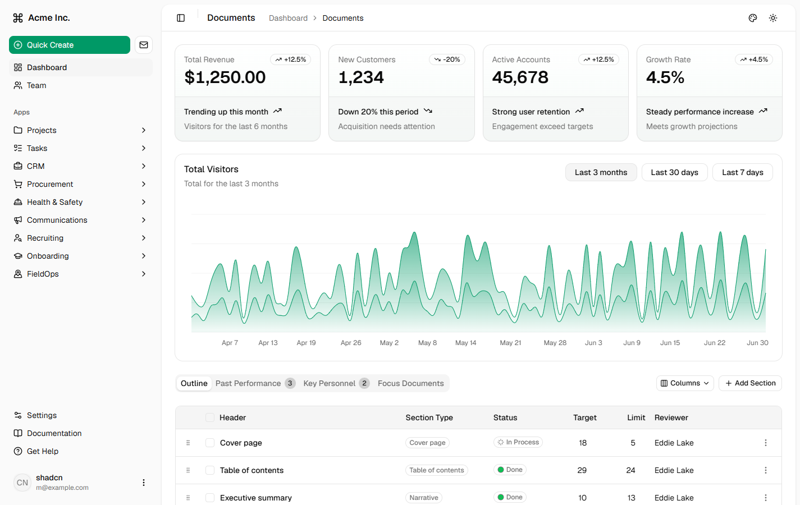
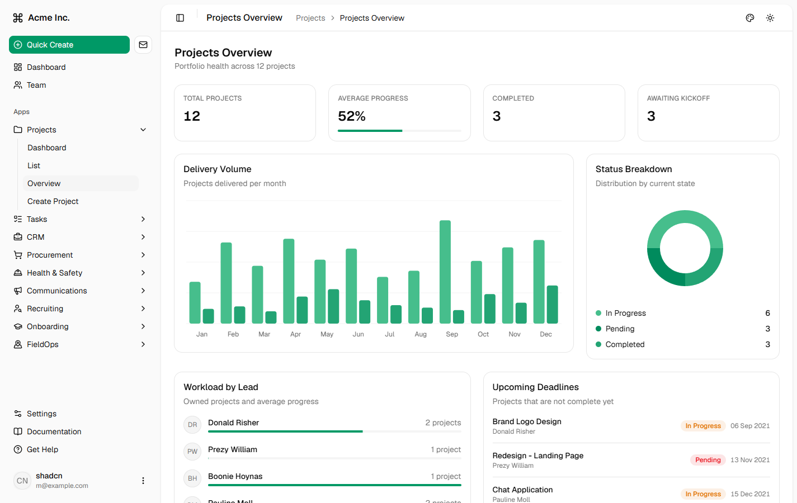
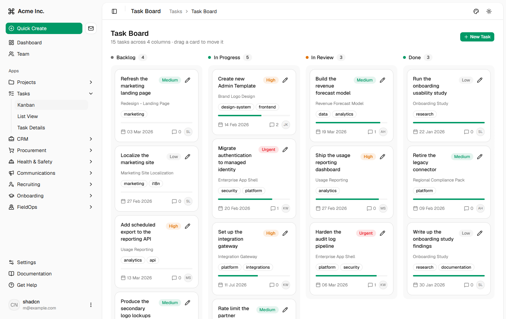
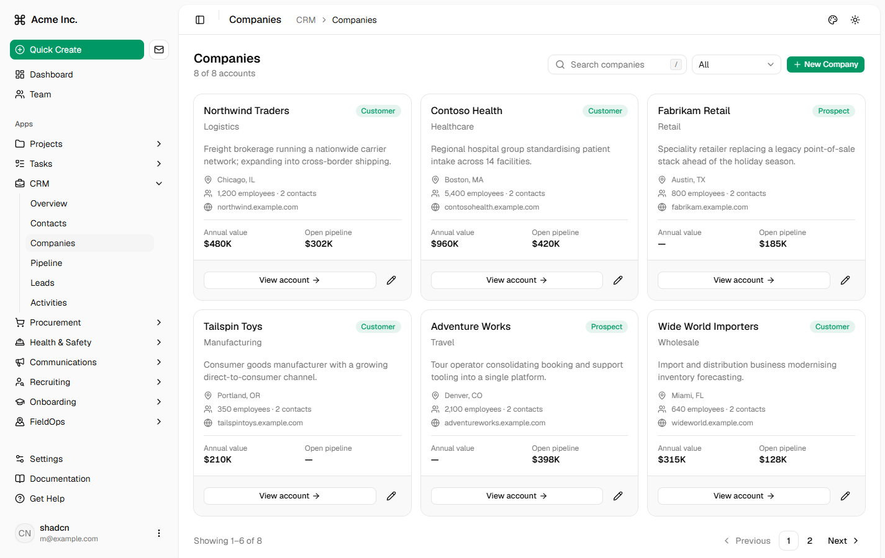
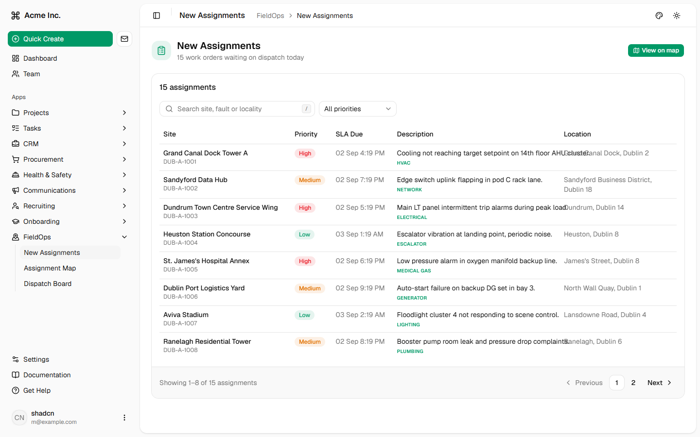
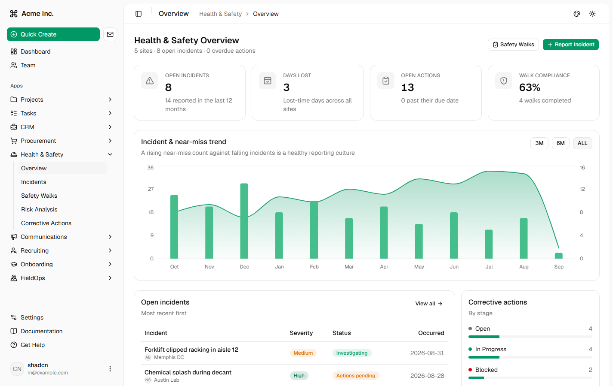
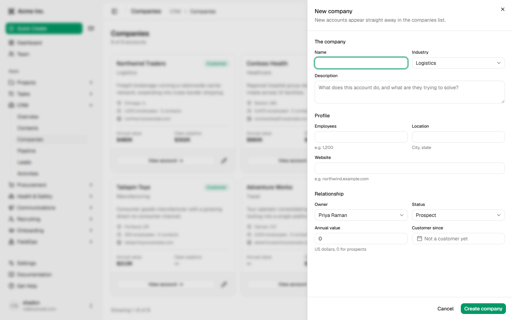
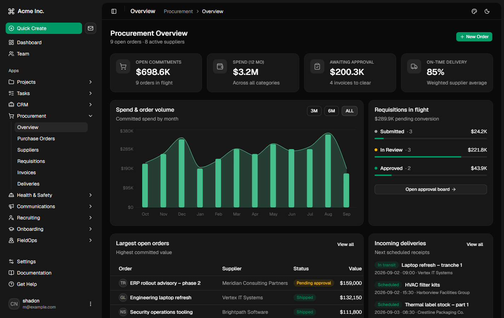
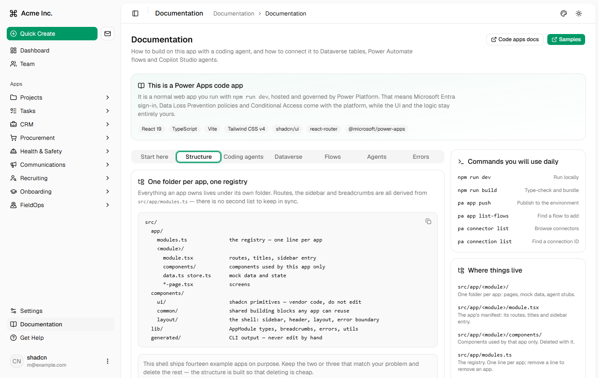

# Enterprise App Shell — shadcn/ui

A production-shaped starter for building **enterprise applications on Power Apps Code
Apps**: React 19, TypeScript, Vite 7, Tailwind CSS v4 and shadcn/ui, with fourteen
working example apps already wired into a real application shell.

Grab it, delete the apps you don't need, keep the shell:

```bash
npx degit microsoft/PowerAppsCodeApps/samples/EnterpriseAppShell-ShadcnUI my-app
cd my-app
npm install
npm run dev
```



---

## Why this exists

Power Apps Code Apps let you ship a normal React app onto Power Platform, with Power
Platform connectors, Dataverse and Copilot Studio available from TypeScript. The tooling
gives you a **blank Vite page**.

A blank page is where most internal apps go wrong. Everyone rebuilds the same twenty
things — a sidebar, routing, breadcrumbs, a page header, a theme toggle, a form drawer,
field validation, pagination, empty states, loading skeletons, error boundaries — and
every team rebuilds them slightly differently, slightly worse, and slightly later than
planned.

This sample is the opposite bet: **start from too much, then delete.**

- **The shell is real, not a mockup.** Collapsible sidebar with nested highlighting,
  hash routing, derived breadcrumbs, light/dark plus colour themes, suspense skeletons
  and an error boundary are all wired and working.
- **Fourteen example apps show the patterns.** Overview dashboards, kanban boards, card
  grids, master–detail, data tables, charts, forms in side sheets, a map. Each one is a
  worked example of "how a page is built here".
- **Deleting an app costs two actions.** Delete the folder, delete one line in the
  registry. Routes, sidebar entry and breadcrumbs disappear with it. That is the design
  constraint the whole structure is built around — because you *will* delete most of it.
- **It is built to be edited by an AI agent.** The folder contract is explicit, the
  conventions are documented in-app, and the module registry gives Copilot or Claude Code
  one obvious place to look.
- **It is still just a web app.** `npm run dev` works with no Power Platform connection
  at all. Mock data lives in each app's `data.ts`, so you can build and demo the UI
  before anyone provisions a thing.

The point is not the fourteen apps. The point is that on day one you are editing a real
application instead of assembling one.

### How this differs from `templates/starter`

[`templates/starter`](../../templates/starter) is the right starting point when you want a
clean, minimal, correctly configured code app and you intend to design the application
yourself. This sample is the right starting point when you want the application *already
designed* — navigation, layout, list and form patterns all decided — and your job is to
swap in your own domain. Reach for the template for something small; reach for this for an
internal app with more than a handful of screens.

---

## Screenshots

| | |
|---|---|
| **Dashboard** — KPI cards, area chart, sortable data table<br> | **Projects** — overview with stat cards and charts<br> |
| **Tasks** — drag-and-drop kanban board<br> | **CRM** — card grid with search, filters and pagination<br> |
| **FieldOps** — work orders, table and map views<br> | **Health & Safety** — incident reporting and analytics<br> |

Forms open in a side sheet with inline validation — the same `FormShell` +
`useFormValidation` pattern everywhere:



Dark mode and colour themes are built in, no extra work per page:



---

## What's inside

| Group | Apps |
|---|---|
| **Main** | Dashboard, Team |
| **Apps** | Projects, Tasks, CRM, Procurement, Health & Safety, Communications, Recruiting, Onboarding, FieldOps |
| **Secondary** | Settings, Documentation, Get Help |

The **Documentation** app (`#/docs`) is worth opening first — it ships the Power Platform
guidance, CLI commands, structure rules and Copilot prompts inside the running app:



**Stack:** React 19 · TypeScript 5.9 (strict) · Vite 7 · Tailwind CSS v4 · shadcn/ui
(radix-nova) · react-router 8 (`HashRouter`) · @tanstack/react-table · recharts · @dnd-kit ·
maplibre-gl · sonner · zod · lucide-react · `@microsoft/power-apps`

---

## Run it locally

```bash
npm install
npm run dev
```

Vite serves on <http://localhost:5173> (it falls back to 5174 and up if the port is
busy). Nothing Power Platform specific is required to run, build or demo the UI.

The FieldOps map renders keyless CARTO basemap tiles out of the box. To use Mapbox tiles
instead, copy `.env.example` to `.env.local` and set `VITE_MAPBOX_TOKEN` to a public
(`pk.*`) token.

Other commands:

```bash
npm run build      # tsc -b && vite build → dist/
npm run preview    # serve the production build
npm run lint       # eslint .
```

Before you commit, the three gates:

```bash
npx tsc -b --noEmit
npm run lint
npm run build
```

> `npm run lint` reports 8 pre-existing errors from the shadcn vendor files and two
> hooks. Those are the baseline — don't fix them, just don't add to them.

### Running it inside Power Apps

Install the CLI once, then point the project at your environment:

```bash
npm install -g @microsoft/power-apps-cli
pa --version

pa app init -n "Enterprise App Shell" -e <environment-id>
```

The environment ID is the GUID in the maker portal URL:
`make.powerapps.com/environments/<environment-id>/home`. `pa app init` writes it into
`power.config.json`.

With `npm run dev` running, the Vite plugin prints a **Local Play** URL that loads your
local dev server inside the Power Apps player, so connectors resolve against the real
environment while you edit code:

```
https://apps.powerapps.com/play/e/<environmentId>/a/local?_localAppUrl=http://localhost:5173/&_localConnectionUrl=...
```

**Prerequisites:** an admin must enable **Power Apps code apps** for the environment in
the Power Platform admin center, and every user who runs the app needs a Power Apps
Premium licence.

---

## Push to production

```bash
npm run build
pa app push
```

`pa app push` uploads the contents of `dist/` and publishes the app in the environment
recorded in `power.config.json`. Share it from the maker portal like any other app.

Checklist before pushing:

1. `npx tsc -b --noEmit`, `npm run lint` and `npm run build` all pass.
2. `power.config.json` points at the environment you actually mean.
3. Every data source you rely on is listed in `connectionReferences` /
   `databaseReferences` — a source added locally but not committed will fail at runtime.
4. Users are licensed and have permission on the underlying tables. Code apps respect
   Dataverse and SharePoint security; they don't bypass it.

---

## Environments

Environment configuration lives in one file: **`power.config.json`**. It is not committed —
`pa app init` writes it, and it holds a GUID that only means something in your tenant.

```json
{
  "version": "1.0",
  "appId": null,
  "appDisplayName": "Enterprise App Shell",
  "region": "prod",
  "appType": "CodeApp",
  "environmentId": "00000000-0000-0000-0000-000000000000",
  "buildPath": "./dist",
  "buildEntryPoint": "index.html",
  "localAppUrl": "http://localhost:5173",
  "logoPath": "Default",
  "connectionReferences": {},
  "databaseReferences": {}
}
```

What to change when you move between dev, test and production:

| Field | Change it when |
|---|---|
| `environmentId` | Always — this is the target environment GUID. |
| `appId` | Set by `pa app push` on first publish. `null` creates a new app; keep the value to update the existing one. |
| `appDisplayName` | Rename per environment if you want "… (Dev)" suffixes. |
| `region` | Only for non-`prod` clouds (GCC, DoD, China). |
| `localAppUrl` | Must match your Vite dev port. Default here is `5173`. |
| `connectionReferences` / `databaseReferences` | Rewritten by `pa app add data-source`. Connection IDs are environment-specific. |

The cleanest way to switch environments is to re-run `pa app init` with the new
environment ID and re-add the data sources, rather than hand-editing GUIDs.

**Promoting properly:** connection IDs don't travel between environments, but
*connection references* inside a solution do. For a real dev → test → prod pipeline, add
data sources via a connection reference instead of a raw connection ID:

```bash
pa solution list
pa connection list-references --solution-id <solution-id>
pa app add data-source --connector <connector-id> --connection-ref <logical-name> --solution-id <solution-id>
```

Then ship the solution between environments and rebind the connection reference on
import. Do not commit secrets or per-user connection IDs to source control.

---

## Connect to data

The apps ship with mock data in `src/app/<module>/data.ts` and session-scoped state in
`store.ts`. Replacing mock data with a real source means changing the reads inside
`store.ts` and keeping the exported hook signatures identical — pages don't need to
change.

Adding any data source generates typed files into **`src/generated/`**:

```
src/generated/
  models/AccountsModel.ts     # the row shape
  services/AccountsService.ts # create, get, getAll, update, delete
```

Never hand-edit `src/generated/` — it is regenerated by the CLI.

### Dataverse (recommended)

Dataverse is the recommended backing store: relational, governed, delegable, with
row-level security and audit built in.

```bash
pa app add data-source --connector dataverse --table <table-logical-name>
```

Use the **logical** name (e.g. `accounts`, `contacts`, `cr123_projects`), not the display
name. Then read and write through the generated service:

```ts
import { AccountsService } from "@/generated/services/AccountsService"
import type { Accounts } from "@/generated/models/AccountsModel"

const result = await AccountsService.getAll({
  select: ["name", "accountnumber"], // always limit the columns
  filter: "statecode eq 0",
  orderBy: ["name asc"],
  top: 50,
})

const accounts: Accounts[] = result.data ?? []
```

Two rules that save you later:

- **Always pass `select`.** Fetching every column is the single biggest cause of slow
  code apps.
- **On update, send only the fields that changed.** Replaying a whole record you read
  earlier marks every column as modified, which fires business logic and pollutes audit
  history.

### SharePoint

SharePoint lists work too, and are a reasonable choice for small, document-adjacent data.
Because SharePoint is *tabular*, you need a connection, a dataset (the site) and a table
(the list).

```bash
# 1. find the connector and create a connection
pa connector list --search sharepoint
pa connection create --connector shared_sharepointonline

# 2. list what that connection can see
pa connection list
pa connection list-datasets --connector shared_sharepointonline --connection-id <connection-id>
pa connection list-tables   --connector shared_sharepointonline --connection-id <connection-id> --dataset <site-url>

# 3. add the list  (--dataset is the site, --table is the list)
pa app add data-source --connector "shared_sharepointonline" --connection-id "<connection-id>" --dataset "https://contoso.sharepoint.com/sites/Operations" --table "Travel%20Request"
```

Names are case-sensitive and URL-encoded — copy them exactly from the `list-tables`
output.

### Other connectors

Non-tabular connectors (Office 365 Users, Outlook, Teams, Copilot Studio…) only need a
connector ID and a connection ID:

```bash
pa app add data-source --connector "shared_office365users" --connection-id "<connection-id>"
```

Removing and refreshing:

```bash
pa app remove data-source  --connector <connector-id> --name <data-source-name>
pa app refresh data-source --connector <connector-id> --name <data-source-name>
```

> Excel Online (Business) and Excel Online (OneDrive) are not currently supported in code
> apps.

---

## Project structure

```
src/
  app/
    modules.ts              the registry — one line per app
    <module>/
      module.tsx            the app's manifest: routes, titles, sidebar entry
      components/           components used by this app only
      data.ts store.ts      mock data and state
      status.ts             badge / status style maps
      *-page.tsx            screens
  components/
    ui/                     shadcn primitives — vendor code, do not edit
    common/                 shared building blocks any app can reuse
    layout/                 the shell: sidebar, header, layout, error boundary
  hooks/                    use-async-action, use-debounced-value, use-form-validation…
  lib/
    module.ts               AppModule / AppRoute types
    routes.ts               breadcrumb titles, derived from the registry
    errors.ts               error normalisation + toast helpers
  generated/                CLI output — never edit by hand
power.config.json           environment + data source configuration (gitignored)
.env.example                optional VITE_MAPBOX_TOKEN for the FieldOps map
docs/screenshots/           the images in this README
```

Everything an app owns lives under its own folder. Routes (`App.tsx`), the sidebar
(`components/layout/app-sidebar.tsx`) and breadcrumbs (`lib/routes.ts`) are **all derived
from `src/app/modules.ts`** — there is no second list to keep in sync.

---

## Remove an app you don't need

1. Delete `src/app/<module>/`.
2. Delete its import and its line in `src/app/modules.ts`.

That is the whole procedure. Its routes, sidebar group and breadcrumbs go with it, and
`npx tsc -b --noEmit` tells you immediately if you missed something.

Two things worth knowing:

- **App-scoped npm packages.** `maplibre-gl` is only imported by
  `src/app/fieldops/components/map-canvas.tsx`, so deleting FieldOps lets you
  `npm uninstall maplibre-gl` and drop roughly a megabyte from the bundle.
- **The one deliberate cross-app link.** `src/app/projects/related-tasks.ts` lets the
  Projects detail page list related Tasks. It is the *only* file where one app imports
  another. If you delete Tasks, make that function return an empty array — nothing else
  in Projects changes.

You can verify no other coupling exists. This should only match `App.tsx`,
`app-sidebar.tsx`, `lib/routes.ts` and `related-tasks.ts`:

```bash
grep -rn 'from "@/app/' src
```

To strip the shell back to a blank slate, delete every folder under `src/app/` except
`docs`, `settings` and `help`, and empty `MODULES` accordingly.

---

## Add an app

1. Create `src/app/<module>/` with your page components.
2. Add `module.tsx` exporting an `AppModule`.
3. Add it to `MODULES` in `src/app/modules.ts`. Order there is sidebar order.

```tsx
// src/app/inventory/module.tsx
import * as React from "react"
import { PackageIcon } from "lucide-react"

import type { AppModule } from "@/lib/module"

export const inventoryModule: AppModule = {
  id: "inventory",
  title: "Inventory",
  group: "apps",               // "main" | "apps" | "secondary"
  icon: <PackageIcon />,
  routes: [
    {
      path: "inventory",
      title: "Stock Levels",
      nav: "Stock Levels",     // omit `nav` to keep a route out of the sidebar
      nested: true,            // stay highlighted on child routes
      element: React.lazy(() => import("./page")),
    },
    {
      path: "inventory/:sku",
      title: "Item Details",
      element: React.lazy(() => import("./details-page")),
    },
  ],
}
```

House conventions worth following so your app looks like the rest:

- Compose from `src/components/ui/` (shadcn) — never edit those files.
- Reuse `src/components/common/`: `FormShell` / `FormSheet` for create-edit forms,
  `DataPagination`, `EmptyState`, `SearchInput`, `DatePicker`, the skeletons.
- Validate with `useFormValidation`; surface failures with the helpers in `lib/errors.ts`.
- Use `import type` for type-only imports (`verbatimModuleSyntax` is on).
- Use the `@/` alias, not relative paths across folders.

---

## Working with GitHub Copilot or Claude Code

This project is deliberately agent-friendly: one registry, one folder per app, explicit
conventions. Both tools work well here.

**GitHub Copilot (VS Code):** open the folder, switch Copilot Chat to **agent mode**, and
describe the outcome rather than the edit.

**Claude Code:** run `claude` in the project root. It reads `CLAUDE.md` or `AGENTS.md`
automatically if you add one — see below.

### Give it the house rules once

Put the conventions in `.github/copilot-instructions.md` (Copilot), `CLAUDE.md` (Claude
Code) or `AGENTS.md` (both), so every request inherits them. Worth stating explicitly:

```md
- Every app lives in src/app/<module>/ and is registered in src/app/modules.ts. Read that file first.
- Never edit src/components/ui/** (shadcn vendor code) or src/generated/** (CLI output).
- Compose UI from src/components/ui and src/components/common. Do not add another UI library.
- Forms use FormShell/FormSheet + useFormValidation. Lists use DataPagination and EmptyState.
- Tailwind v4 only, with container queries. Use cn() from @/lib/utils.
- TypeScript is strict with verbatimModuleSyntax: use `import type` for type-only imports.
- Do not add cross-app imports. src/app/projects/related-tasks.ts is the only exception.
- Finish by running: npx tsc -b --noEmit, npm run lint, npm run build.
  npm run lint has 8 pre-existing errors — do not fix them, do not add new ones.
```

### Prompts that work well here

> **Add a new app.** "Create a Procurement app at `src/app/procurement/` with an overview
> page, a purchase orders list and a details page. Follow the structure of
> `src/app/projects/`. Register the routes in `src/app/procurement/module.tsx` and add it
> to `src/app/modules.ts`."

> **Remove an app you don't need.** "Delete the `src/app/recruiting` folder and remove its
> line from `src/app/modules.ts`. Nothing else references it, so the routes, sidebar entry
> and breadcrumbs all disappear with it."

> **Start from scratch.** "Delete every module under `src/app/` except docs, settings and
> help, update `src/app/modules.ts` to match, then create a single app called Requests
> with a list page and a details page using the same patterns."

> **Swap mock data for Dataverse.** "The Projects app reads from
> `src/app/projects/data.ts`. Replace those reads in `src/app/projects/store.ts` with
> `ProjectsService` from `src/generated/services/`, keeping the exported hook signatures
> unchanged so the pages don't need edits."

> **Review before you ship.** "Run `npx tsc -b --noEmit` and `npm run lint`, then fix
> anything you introduced. Do not touch the pre-existing errors in `src/components/ui`."

### Let it check its own work

```bash
npx tsc -b --noEmit
npm run lint
npm run build
```

Read the diff before you accept it. An agent that cannot run the Power Apps CLI will
happily invent a connector name or a table schema — the CLI commands in this README and
in the in-app Documentation are the source of truth.

---

## Known gaps

- The React Compiler is not enabled, because of its impact on dev and build performance.
  To add it, see the [installation guide](https://react.dev/learn/react-compiler/installation).
- All data is mock data held in session state. Nothing persists across a hard reload
  until you connect a real data source.

---

## Further reading

- [Power Apps code apps overview](https://learn.microsoft.com/power-apps/developer/code-apps/overview)
- [Power Apps CLI reference](https://learn.microsoft.com/power-apps/developer/code-apps/reference/cli)
- [Connect your code app to data](https://learn.microsoft.com/power-apps/developer/code-apps/how-to/connect-to-data)
- [Connect your code app to Dataverse](https://learn.microsoft.com/power-apps/developer/code-apps/how-to/connect-to-dataverse)
- [SharePoint operations](https://learn.microsoft.com/power-apps/developer/code-apps/how-to/sharepoint-operations)
- [shadcn/ui](https://ui.shadcn.com) · [Tailwind CSS v4](https://tailwindcss.com) · [react-router](https://reactrouter.com)

Other starting points in this repo: [`templates/`](../../templates) for minimal
scaffolds, [`samples/`](../) for more focused examples.

---

Licensed under the MIT License — see [LICENSE](../../LICENSE).
